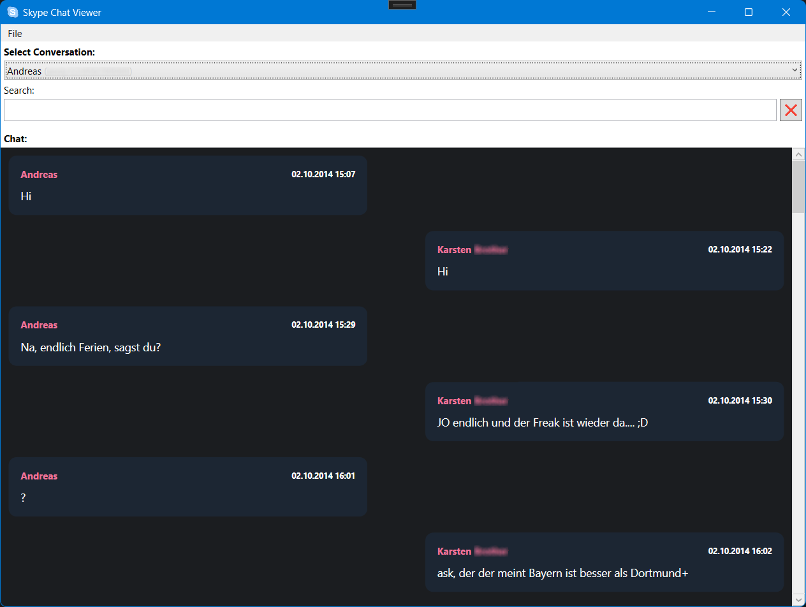

## Skype Chat Viewer

### Purpose
This tool can be used to view old Skype Chats from old computers!   
If you know you have a working Skype Instance there you should firstly export the chat before
connecting this computer to the internet!   
I made this tool to make it easier to view the exported chats, I didn't find any other tool which
could render the chat like a "real" chat.   
> :warning: ATTENTION: This tool works only with old skype versions!

### Exporting your old Skype Data
- The data is located at `%appdata%\Skype\your_profile_folder`.
- You can backup the whole directory, but for reading the chats you only need to export the `main.db`-file.
- You can open this file then with this tool or copy this file to the same directory of this tool and it opens automatically!
- You can select the conversations you want to read

### Features
- Shows all conversations!
- Loads messages with paging (loads more messages if you scroll down)!
- Shows chat messages like a real chat (time, sender, left: if you recieved it; right: if you sent it)!
- Parses smileys like `<ss type="smile">:)</s>` as `:)`!
- Search in chat using the searchbox!

### Screenshot

### Icons
Icons used from <a href="https://icons8.com/">Icons8</a>
